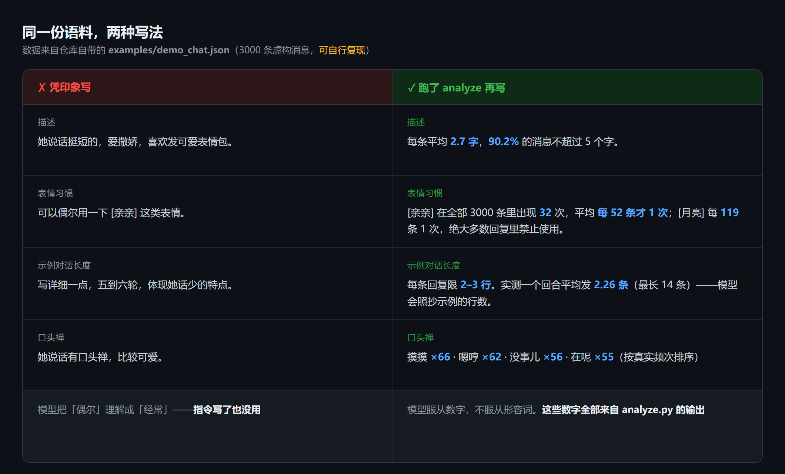
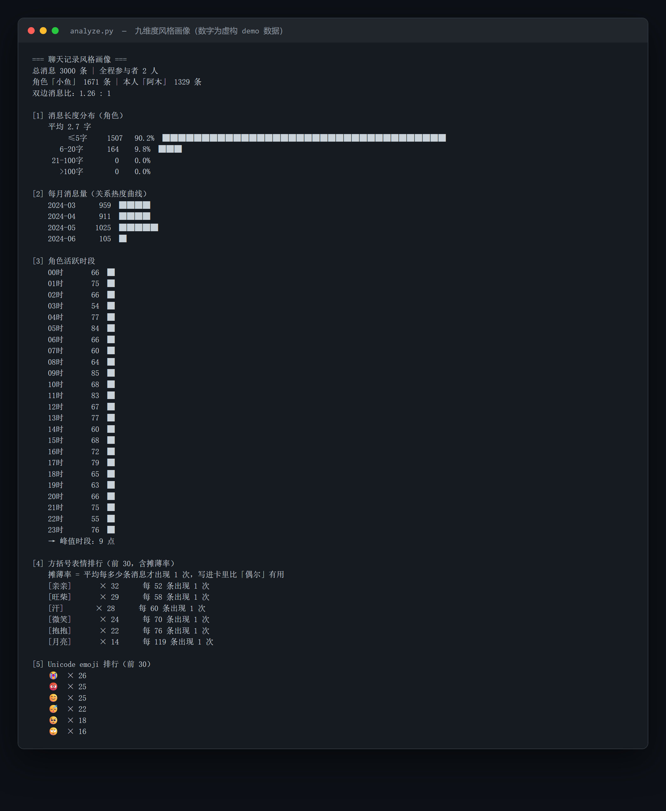

# chat2chara

**English** | [中文](README.md)

Turn a chat log into a working AI character card — **built from real statistical evidence, not from what you remember.**

**If you have a conversation history with tens of thousands of messages**, and every card maker out there only lets you *describe* a person — that description can't capture how they actually talk. **This tool is for you.**



Left: how most character cards get written — a handful of adjectives. Right: how this tool does it — count first, write after.

**Models obey numbers, not adjectives.** If you write "uses [kiss] occasionally", the model reads *often*. Write "appears once every 52 messages on average", and it finally understands what rare means. That difference is the whole project.

Feed it a chat-log export (or a subtitle file) and it produces a `chara_card_v2` character card you can import into SillyTavern and start talking to.

> 🧰 What you need: **Python** · a chat log (or a subtitle file) · about half an hour

---

## What problem this solves

Existing tools fall into two camps, and neither is good at "a card that actually sounds like that person":

**Camp 1 — fine-tuning.** Take the chat log and fine-tune an LLM.
High ceiling, but it needs a GPU, 16 GB+ of VRAM, and a full retrain for every new character. And the output is a model, not a card.

**Camp 2 — generic card generators.** The various AI card makers.
Their problem: **the input is *your description***. You tell it "she's tough on the outside but soft inside, uses reduplicated words", and it writes exactly that. But your impression of a person is usually distorted. Cards written from impressions fall apart after two messages.

**This project takes a third path: write the card from the statistical fingerprint of the real record.**

No model training. No GPU. Everything runs locally. No LLM API calls, no tokens, no cost.

The point is that it measures not "how you remember them" but **how they actually appear in the record** —

For example. Suppose an emoji shows up 1,200 times across 200,000 messages. Writing "she uses this emoji occasionally" is useless — the model reads "occasionally" as "frequently". But if you compute that it appears **once every 170 messages on average**, and put that number straight into the card's instructions, the model finally knows what rare means.

That number is the **dilution rate**. It is the most fundamental difference between this project and everything else.

---

## Workflow

Both source types feed the same pipeline: **real chat logs** (JSON) go through `json2txt.py`, **anime / film subtitles** (.srt / .ass) go through `srt2txt.py`. From step two onward it is identical.

```
Chat log export (JSON)
        ↓
   json2txt.py          normalize into the pipeline format
        ↓
    analyze.py           nine-dimension statistics (local, the core)
        ↓
    sample.py            time-stratified sampling of continuous excerpts
        ↓
   ┌─────────────────┐
   │ human / LLM read │   ← the only step that may use an LLM, and it's optional
   └─────────────────┘
        ↓
  character card JSON (chara_card_v2)
        ↓
  validate_card.py       validation + structure check
        ↓
   deploy_card.js        deploy into SillyTavern
        ↓
     chat in the tavern
```

**Only the middle "read it" step may use an LLM — and it doesn't have to.** You can read `sampled.txt` yourself and fill the card by hand.

---



> This is real output from `analyze.py` (numbers come from the fictional demo data shipped with the repo).
> All nine dimensions are backed by numbers — copy them into the card and your settings are *evidence-based* instead of *impression-based*.

---

## Before you start: what to install

**Python is the only hard requirement.** Everything below is free and open source.

| Software | What it's for | Required? | Download |
|---|---|---|---|
| **Python 3.9 or newer** | Runs the statistics and sampling scripts (the core) | ✅ Yes | [python.org/downloads](https://www.python.org/downloads/) |
| **SillyTavern** | Where you actually talk to the card | ✅ Yes | [GitHub](https://github.com/SillyTavern/SillyTavern) · [Install docs](https://docs.sillytavern.app/installation/) |
| **An LLM API** | Makes the character actually speak | ✅ Yes (configured in SillyTavern) | Any OpenAI-compatible provider |
| **Node.js** | Only needed by the "deploy card into the tavern" script | ⭕ Optional | [nodejs.org](https://nodejs.org/) |
| **Git** | To clone this repo | ⭕ Optional (you can also download a ZIP) | [git-scm.com/downloads](https://git-scm.com/downloads) |

### The one Python gotcha

On Windows, the installer's first screen has a checkbox at the bottom — **"Add Python to PATH"**. **You must check it.**
If you forget, running `python` later gives you "not recognized as an internal or external command".

### Verify it worked

Open a terminal (Windows: `Win + R`, type `cmd`, Enter. macOS: open Terminal), then run:

```bash
python --version
```

If you see `Python 3.x.x`, you're set.

> macOS ships with a Python, but it's often old. Installing a fresh one from the official site is easier anyway.

### Every command from here on goes in that terminal

Beginners fear error messages. One rule: **read the last line** — that's the actual cause. The lines above it are just the call stack.

---

## Quick start

### Step 0: get the project

**With Git (recommended):**

```bash
git clone https://github.com/cc66611/chat2chara.git
cd chat2chara
```

**Without Git:** click the green `Code` button on the repo page → `Download ZIP`, then unzip wherever you like.

> This project has **zero third-party dependencies** — no `pip install` of anything. Python's standard library is enough.
> That's the biggest difference from similar tools: **there is no environment to set up.**

### Step 1: run it on fake data first (sanity check)

The repo ships a generator that produces **entirely fictional** chat logs (no real person's data). Run it once to confirm your machine is fine, then swap in your own data.

**Enter the scripts directory:**

```bash
cd scripts

# 1. generate fictional data (3000 fake messages, no real-person information)
python make_demo_data.py -o ../examples/demo_chat.json -n 3000

# 2. normalize into the pipeline format
python json2txt.py -i ../examples/demo_chat.json \
                   -o ../examples/demo_chat.txt \
                   --char-name "小鱼" --user-name "阿木"

# 3. full statistics
python analyze.py -i ../examples/demo_chat.txt \
                  -o ../examples/demo_stats.txt \
                  --char-name "小鱼" --user-name "阿木"

# 4. sample
python sample.py -i ../examples/demo_chat.txt \
                 -o ../examples/demo_sampled.txt --target 800
```

**What success looks like at each step:**

| Command | You should see |
|---|---|
| 1 | `生成 3000 条虚构消息 -> ...` (3000 fictional messages generated) |
| 2 | `载入 3000 条，写出 3000 条，跳过 0 条` (3000 read, 3000 written, 0 skipped) |
| 3 | `OK -> ...` plus `角色「小鱼」/ 本人「阿木」，共 3000 条` |
| 4 | `采样 ... 条（N 个月）` (sampled N messages across N months) |

**Then open `examples/demo_stats.txt`** — that is a complete style profile, and it's the thing this project hands you.

### Using your own data

**On data acquisition:**

This project **does not provide, teach, or touch** any means of exporting, decrypting, or scraping chat records.

You are responsible for making sure you have the legal right to the data you process (normally conversations you took part in), and for complying with the relevant platform's terms of service and local law. **For records involving another person, get their informed consent.**

**But one thing is worth knowing: some platforms ship an export feature themselves.** Those exports are standard files — no third-party tool, no decryption involved — and are safe to use:

| Platform | Official export path | Output | Works directly? |
|---|---|---|---|
| **Telegram Desktop** | Settings → Advanced → Export Telegram data → check "Machine-readable JSON" | `result.json` | ✅ Yes, straight in |
| **QQ** | Message Manager → Export message history | txt / mht | ⚠️ Convert to JSON first |

> **WeChat is deliberately not on this list.** It has never offered a readable export — every "WeChat export" tool out there has to read its encrypted database, which is exactly the area this project refuses to touch. That's not a capability limit, it's a **boundary**.

Once you have the file, shape it into either structure below and it plugs straight in:

```json
[
  { "time": "2024-03-01 20:15:00", "sender": "them", "content": "hey", "type": 1 },
  { "time": "2024-03-01 20:15:30", "sender": "me",   "content": "you eating?", "type": 1 }
]
```

Wrapping it in `{"messages": [...]}` also works. Field names accept common aliases (`timestamp` / `createTime` / `from` / `text` / `msg`, etc.) — see `scripts/json2txt.py`.

Not sure who the speakers are? Take a look first:

```bash
python json2txt.py -i your_export.json --list-senders
```

### Using subtitles (for fictional characters)

The path above replicates a real person. If you want a **character from an anime, game, or novel**, just swap the source for subtitles — same card, same statistics, but **no real person involved at all**.

```bash
# 1) see which speakers appear in this subtitle file
python srt2txt.py -i ../subs/ep01.srt --list-speakers

# 2) convert to pipeline format. --date stamps the episode with a date
python srt2txt.py -i ../subs/ep01.srt -o ../subs/ep01.txt --date 2024-01-01

# 3) analyze several episodes together (identical to the chat-log path from here)
python analyze.py -i ../subs/all.txt -o ../subs/stats.txt --char-name "Hoshino"
```

**One of the nine dimensions must be ignored for subtitles:**

| Dimension | For subtitles |
|---|---|
| [1] message length / [4] bracket emoji / [5] emoji | ✅ Same |
| [6] catchphrases / [7] frequent fragments / [8] sentence endings | ✅ Same |
| [9] burst density | ✅ Same |
| [2] monthly volume | ⚠️ Becomes "**lines per episode**" — shows which episodes the character dominates |
| [3] activity hours | ❌ **Meaningless** — subtitle timestamps are in-story time, not a sleep schedule |

Eight of nine still work. Skip [3] when writing the card. See [docs/04-subtitle-source.md](docs/04-subtitle-source.md) for details.

> **Boundary:** subtitles (anime / film / audio drama) are fine. **Extracting game text is not** — that involves reverse engineering, and it's the same category as reading WeChat's database.

---

## The three tuning rules

These were learned the hard way in testing. They're worth more than the scripts.

### 1. Example length wins, instructions lose

**The model copies the line count of `mes_example` and `first_mes` exactly.**

If you want "occasionally sends two or three messages in a row", keep each example reply under 5 lines and `first_mes` under 6. Write ten lines in the example and the model will give you ten lines every time — an instruction saying "keep it short" won't hold it back.

Also pin it in the instructions: **at most 3–5 lines, fewer is better, if you can't finish it say the rest next turn.**

### 2. Use the dilution rate, never "occasionally"

**Banning isn't realistic; the dilution rate is.**

Don't write "occasionally uses [smile]". Write:

> `[smile]` appears once every 170 messages on average across the whole record; it is banned from the large majority of replies.

Copy that number straight out of `analyze.py`. Models obey specific numbers far more reliably than adjectives.

### 3. Kill scene-hogging with explicit instructions

Left alone, models reliably make four mistakes:

- Playing several turns by themselves, without waiting for you
- Inventing time passing ("(a moment later)", "three seconds on")
- Speaking **for you**
- Scolding you for "not replying" before you've replied

`post_history_instructions` must contain a **"one turn, then stop"** rule that bans each of these explicitly.

**Also: never demonstrate a time skip in the examples** — the model will learn it.

---

## Using a Chinese LLM (Zhipu GLM as the example)

> Register at [open.bigmodel.cn](https://open.bigmodel.cn/) and create an API key in the console (new accounts usually get free credits).

In SillyTavern, use `Custom (OpenAI-compatible)`:

- URL: `https://open.bigmodel.cn/api/paas/v4`
- Model: whatever your account can access

**One gotcha deserves its own note: newer GLM models force extended thinking, which makes them slow.**

Approaches that **do not work**:

- `thinking: { type: "disabled" }` → HTTP 400, error code 1210
- `thinking: { effort: ... }` → thinks at every level anyway, no difference

**The only thing that works** is a top-level parameter:

```yaml
reasoning_effort: low
```

That gives you instant replies with zero thinking. The catch is that SillyTavern doesn't forward it by default — inject it manually:
**API panel → "Additional Parameters" next to Connect → "Include Body Parameters"**, and paste the YAML above.

---

## Deploying to SillyTavern

> **Haven't installed the tavern yet?** Start with the official docs: [docs.sillytavern.app/installation](https://docs.sillytavern.app/installation/)
> Roughly three steps: install [Node.js](https://nodejs.org/) → `git clone` the SillyTavern repo → double-click `Start.bat` on Windows.

```bash
node scripts/deploy_card.js -i your_card.json \
     -d "C:/SillyTavern/data/default-user/characters"
```

Two things you must do afterwards, **or you'll think the script didn't work**:

1. **Refresh the page** (F5) — SillyTavern doesn't rescan the character directory while running
2. **Start a new chat** — old chat history still contains the bad samples and will keep dragging the model off. Change the card and keep the old chat, and you'll wonder why nothing improved.

To check a card before deploying, validate without writing:

```bash
node scripts/deploy_card.js -i card.json -d <dir> --dry-run
```

### Alternative: build a PNG card

The script above copies JSON into the tavern's directory. **If you want a card you can just drag in** (avatar included), pack the JSON into a PNG:

```bash
python json2png.py -i your_card.json -o your_card.png --avatar avatar.png
```

No avatar image is fine too — it generates a gradient placeholder you can replace inside the tavern.

How PNG cards work: the card data is stored as base64 inside the image's `tEXt` text chunks. This script **writes both chunks** (`chara` for V2, `ccv3` for V3), so any version of the tavern can read it.

> ⚠️ **Never send a PNG card through WeChat.** WeChat recompresses images and the `tEXt` chunks are lost, destroying the card. Send the JSON instead.

### Card specs: V2 or V3?

There are three generations of the card spec, and **all three import fine**:

| Version | Traits | When to use |
|---|---|---|
| V1 | Six flat fields, no lorebook, no alternate greetings | Legacy cards |
| **V2** | Envelope structure + lorebook + alternate greetings | **What this project outputs. Readable by every version — the safest choice** |
| V3 | Adds `assets` (sprites / audio), `nickname`, multilingual notes, the `.charx` container | When you need sprites or voice |

The tavern **prefers V3 when reading**, but V3 is backward-compatible with V2 by design — so a card carrying only V2 fields works everywhere.
`validate_card.py` recognizes the `spec` of all three and tells you which one it's checking.

---

## Repository layout

```
chat2chara/
├── scripts/
│   ├── json2txt.py          chat log JSON → pipeline format
│   ├── analyze.py           nine-dimension style statistics (the core)
│   ├── sample.py            time-stratified weighted sampling
│   ├── validate_card.py     card validation + structure check
│   ├── deploy_card.js       deploy into SillyTavern
│   ├── srt2txt.py           subtitles (.srt/.ass) → pipeline format
│   ├── json2png.py          card JSON → PNG card (drag-and-drop ready)
│   ├── check_privacy.py     pre-publish privacy scan
│   └── make_demo_data.py    generate fictional demo data
├── templates/
│   └── chara_card_v2_blank.json   annotated blank card template
├── examples/                demo data and sample outputs
├── assets/                  screenshots and images
└── docs/
    ├── 01-data-pipeline.md   the data pipeline in depth
    ├── 02-card-authoring.md  how to write each card field
    ├── 03-tuning-rules.md    full derivation of the three rules
    └── 04-subtitle-source.md subtitles (fictional characters)
```

---

## What the nine dimensions measure

`analyze.py` outputs the following nine items. Each one is the evidence for a specific card field:

| # | Dimension | Used for |
|---|---|---|
| 1 | Message length distribution | Decides how choppy speech is |
| 2 | Monthly volume | Relationship intensity curve, for background setting |
| 3 | Activity hours | When the character is most active |
| 4 | Bracket emoji + dilution rate | **The data behind rule #2** |
| 5 | Unicode emoji ranking | Same |
| 6 | Catchphrase candidates | Fills the `personality` field |
| 7 | Frequent word fragments | Extra language texture |
| 8 | Sentence-ending habits | Tunes the tone |
| 9 | Burst density | Decides how many messages per turn |

---

## Ethics and boundaries

This project describes **how a person talks, using data**. That has real risks, so take it seriously:

- **Get consent.** If you're replicating someone else's way of speaking, confirm first that they know and agree. This isn't a formality — turning someone's way of speaking into an infinitely callable copy is on the same order as publishing their photos.
- **Never publish a real person's card.** Share the method, not a specific human being.
- **Don't use it to deceive.** Don't pass a generated copy off as the real person in conversation, to gain trust, or for any other deception.
- **Keep data local.** This pipeline runs fully offline and uploads nothing. Keep it that way.

---

## Before you publish or commit

If you're forking this, adding your own material, or pushing, **run the check first**:

```bash
python scripts/check_privacy.py
```

It scans every file **that would be handed to git**, looking for phone numbers, WeChat IDs, local paths, API keys, and the like.
Files ignored by `.gitignore` are skipped — they can't reach the repo anyway. Hits are listed with file, line number and content, and the exit code is 1; clean runs return 0.

> ⚠️ **It cannot protect your git history.** Once real data has been committed, deleting the file still leaves it in the history.
> So the order is always: **confirm it's clean → then `git add`.**

---

## License

MIT
